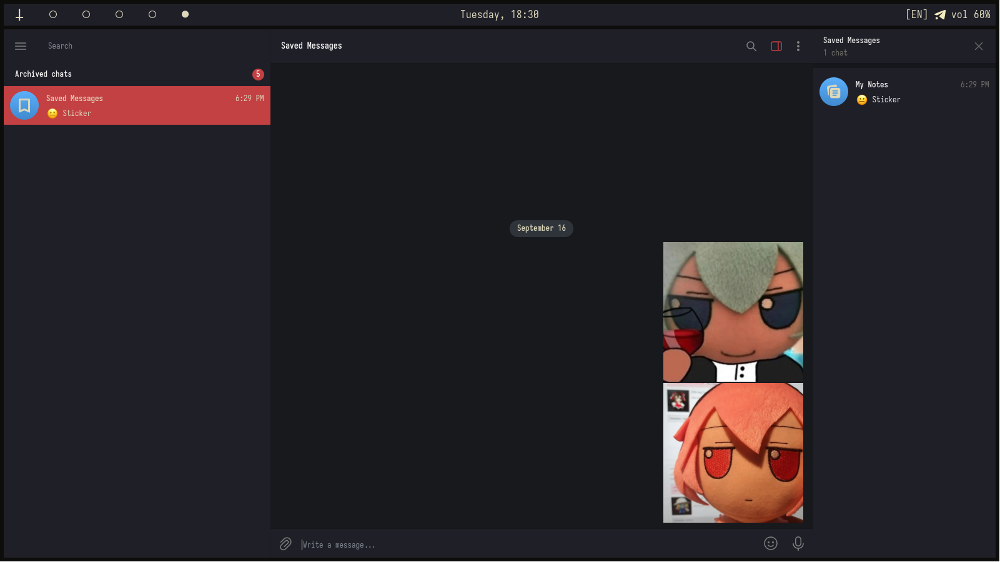

# 🌠 Gallery




# 💾 Installation
```bash
# Clear arch (btw!) installation from tty
sudo pacman -S zsh waybar hyprland hyprpaper hyprsunset hyprpicker telegram-desktop fuzzel foot kvantum mako micro helix cava fastfetch zellij git curl wget ripgrep xdg-user-dirs yazi eza bat ttf-iosevka-nerd firefox noto-fonts noto-fonts-emoji cliphist

xdg-user-dirs-update

git clone https://github.com/suicidelynn/KanagawaDotfiles && cd KanagawaDotfiles

mkdir -p ~/.icons
mkdir -p ~/.themes
mkdir -p ~/.config 
mkdir -p ~/Pictures/wallpapers

mv config/* ~/.config
mv icons/* ~/.icons
mv themes/* ~/.themes
mv assets/wallpaper.png ~/Pictures/wallpapers

chsh -s /usr/bin/zsh
sh -c "$(curl -fsSL https://raw.githubusercontent.com/ohmyzsh/ohmyzsh/master/tools/install.sh)"

mv .zprofile ~
mv .zshenv ~
mv .zshrc ~

systemctl reboot
```

> [!WARNING]  
> If you are not an Nvidia user with proprietary drivers, you will need to manually remove some environment variables 
> from this [file](./config/hypr/hyprland.conf). In addition, if you are using a multi-monitor system, you must configure
> this yourself in the same file. You may also need to modify this [file](config/hypr/hyprpaper.conf) for the wallpaper 
> to display correctly.

> [!TIP]
> BTW, you can use my [kanagawa theme](https://t.me/addtheme/KanagawaRed) for telegram.
